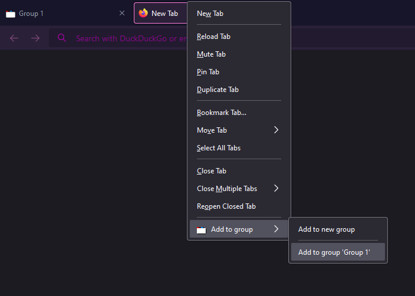

# Tab grouper
Groups tabs in Firefox the same way you can do in chromium based browsers, replicated in the best way Firefox can currently manage.  
The plugin allows you to group tabs together, and hide tabs that are not in the currently active group (if any).

## Get
### Manual download
(This isn't currently possible, but will be soon, so I'm leaving this part in).  
Download the .xpi file from the latest [release](https://github.com/TheNamlessGuy/browser-tab-grouper/releases).  
Drag and drop the file into your Firefox instance to install it.

### From Firefox AMO
The download page is [here](https://addons.mozilla.org/firefox/addon/tab-grouper/).

## Usage
After installing the plugin, you start by simply right clicking on a tab and selecting "Add to new group" from the Tab grouper interface:  

This will open a "group tab":  

Clicking on the tabs listed in the group will get to you to that tab. Closing the group tab itself will get rid of the group entirely.  
Moving to a tab outside of the group will hide all the tabs within the group, aside from the group tab itself:  

The first time you move outside of a group, you will most likely get a popup like this:  
  
It's of course up to you, but I recommend pressing the "Keep tabs hidden" option, or this plugin won't work as intended.

Adding another tab to the group is as simple as right clicking on it and selecting "Add to group <group name>":  

Similarly, you can remove a tab from a group (or move it to another group) by right clicking on the tab in the group and selecting the appropriate option:  

There are a few more options, such as:
* Renaming a group - Just edit the name on the group tab page
* Tabs opened from within the group should be kept in the group - Check the checkbox on the group tab page

## Future plans and known issues
See [this issue](https://github.com/TheNamlessGuy/browser-tab-grouper/issues/1).

## Cross-hosted
This repository is hosted both on [GitHub](https://github.com/TheNamlessGuy/browser-tab-grouper) and [Codeberg](https://codeberg.org/TheNamlessGuy/browser-tab-grouper).
